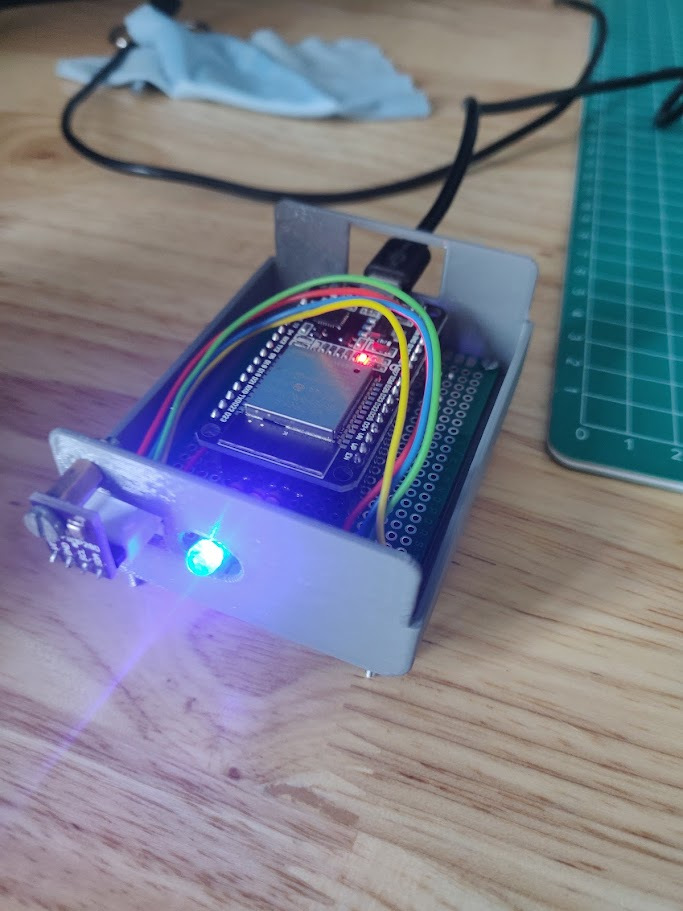

# README
A simple device that checks the inside temperature vs the outside temperature. If the inside temperature is higher than the inside temperature the LED will turn blue, otherwise it will turn red. In this way you can easily see if the inside temperature is higher or lower than the outside temperature and open a window if necessary.

Contains both the 3d model and the code for the device.
The code contains the arduino code for use with the esp32 and a python script with which you can look at the recorded temperatures.
 




## components

- ESP32
- bme280
- multicolor LED
- 3D printer (if you want to print the case)
- micro usb cable
- prototype board
- wires
  
## Installation
You need to connect the esp32 to your wifi as well as a free account on [openweathermap](https://openweathermap.org/) to get the outside temperature. You also need to install the bme280 library for the temperature sensor.

Get the api and create a new file containing config.h in the arduino code folder. This will contain the ssid, password, city, country code and the openweathermap api key. So that the code can connect to the wifi and get the outside temperature.
```c++
```
// config.h

#ifndef CONFIG_H
#define CONFIG_H

const char* ssid = "your_SSID";
const char* password = "your_password";
String openWeatherMapApiKey = "your_OpenWeatherMap_API_key";
String city = "your_city";
String countryCode = "your_country_code";

#endif
```

## port connections

LED: 
red -> 25
green -> 33
blue -> 32

Connect the bme280 to the esp32 as follows:
- VCC -> 3.3V
- GND -> GND

the default I2C for mine are:
- SDA -> 21
- SCL -> 22

these might be different for your esp32 so check the datasheet.
